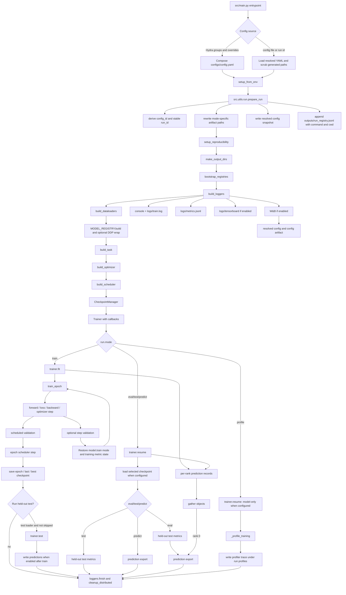
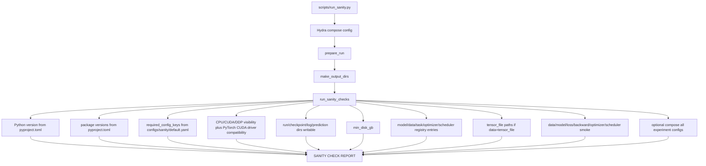
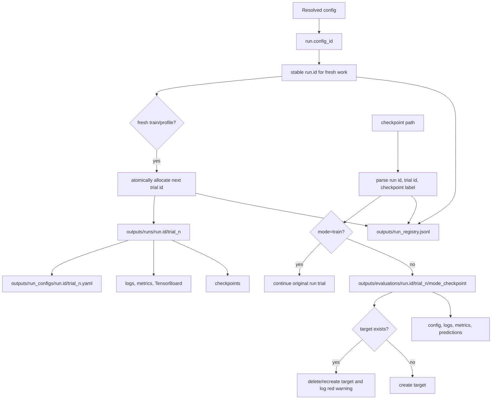
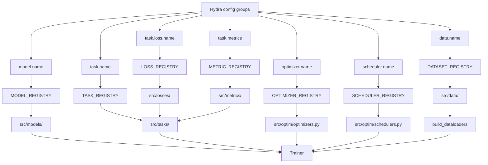

# Repository Flowchart

This file is a visual map of how the framework runs from each entrypoint to final artifacts. Use it when you want to customize the template and need to know which files must change together.

## Entrypoint Map

```mermaid
flowchart TD
    User[User / Researcher]

    User --> UVTrain[uv run python src/main.py]
    User --> ReplayTrain[uv run python src/main.py --config-file / --from-run / --resume-run]
    User --> UVSanity[uv run python scripts/run_sanity.py]
    User --> ShellTrain[bash scripts/train.sh]
    User --> ShellEval[bash scripts/eval.sh CHECKPOINT]
    User --> ShellPreprocess[bash scripts/preprocess.sh]
    User --> ShellProfile[bash scripts/profile.sh]
    User --> ShellSweep[bash scripts/sweep.sh]
    User --> MakeTargets["make install / train / eval / sanity / test / lint"]
    User --> TrainConsole[ml-train]
    User --> SanityConsole[ml-sanity]
    User --> RegistryCLIs["ml-run-registry / ml-compare-runs / ml-plot-metrics / ml-export-checkpoint / ml-cleanup-runs"]
    User --> EvaluateCLI[ml-evaluate-run]
    User --> VerifyCLI[ml-verify-checkpoints]

    ShellTrain --> Main[src/main.py]
    ShellEval --> Main
    UVTrain --> Main
    TrainConsole --> Main
    ReplayTrain --> ReplayConfig[Load resolved YAML and scrub generated paths]
    ReplayConfig --> Main
    MakeTargets --> Main

    UVSanity --> SanityScript[scripts/run_sanity.py]
    SanityConsole --> SanityScript
    MakeTargets --> SanityScript

    RegistryCLIs --> RegistryTools[registry, comparison, plotting, export, and cleanup scripts]
    RegistryTools --> RunRegistry[outputs/run_registry.jsonl]
    RegistryTools --> Reports[outputs/reports or requested output path]
    RegistryTools --> Exports[outputs/exports or requested output path]
    RegistryTools --> Archives[outputs/archives]
    EvaluateCLI --> EvaluateRunScript[scripts/evaluate_run.py]
    EvaluateRunScript --> Main
    VerifyCLI --> VerifyScript[scripts/verify_checkpoints.py]
    VerifyScript --> CheckpointDirectory[run checkpoint directory]

    ShellPreprocess --> Preprocess[src/data/preprocess.py]
    ShellProfile --> ProfileConfig[Load configs/profiler.yaml]
    ProfileConfig --> ProfileInline[Profiler workload in scripts/profile.sh]
    ShellSweep --> WandBSweep[wandb sweep configs/sweep.yaml]

    SanityScript --> SanityFlow[Sanity-only flow]
    Main --> MainFlow[Train / Eval / Test / Predict / Profile flow]
    Preprocess --> TensorFiles[data/processed/*.pt]
    ProfileInline --> ProfileOutputs["profiler.trace_dir, default outputs/profiles"]
    WandBSweep --> Main
```



Notes:

- `scripts/train.sh` is a thin wrapper around `uv run python src/main.py "$@"`; it can pass `--config-file outputs/run_configs/<run_id>/trial_<n>.yaml --run-id replayed_run` for replay.
- `scripts/eval.sh` calls `src/main.py` with `run.mode=eval` and `checkpoint.resume=<path>`.
- `scripts/run_sanity.py` only performs environment/config/smoke validation; it does not train.
- `scripts/preprocess.sh` generates toy tensor-file data for `data=tensor_file`.
- `scripts/profile.sh` loads `configs/profiler.yaml` and runs a small profiler workload outside the main trainer.
- `scripts/run_registry.py`, `compare_runs.py`, `plot_metrics.py`, `evaluate_run.py`, `export_checkpoint.py`, and `cleanup_runs.py` use saved run metadata to inspect, replay, evaluate, export, archive, or clean previous runs. `scripts/verify_checkpoints.py` operates directly on a checkpoint directory.
- `scripts/sweep.sh` creates a W&B sweep from `configs/sweep.yaml`, then each W&B agent run calls `src/main.py`.
- `Makefile` targets mostly forward to the same Python entrypoints; its current `lint` and `fmt` targets cover `src`, `tests`, and `scripts/run_sanity.py`.

## Main Training And Evaluation Flow



## Sanity Check Flow



## Artifact Layout



Key behavior:

- Hydra timestamp output folders are disabled; `prepare_run` owns all generated paths.
- Fresh repeated configs keep one stable run id and receive consecutive code-managed trial ids.
- Users do not configure trial ids, tracking ids, or W&B run names.
- Explicit checkpoint paths are the identity source for resume/evaluation.
- Evaluation folders include mode and checkpoint label, so `eval_best`, `eval_last`, and `eval_epoch_0005` coexist.
- Repeating one evaluation target replaces only that target folder and logs a bold red warning.
- Tracking ids mirror local identity: `<run.id>-trial-<n>` or `<run.id>-trial-<n>-<mode>-<checkpoint>`.
- `--config-file`/`--from-run` are fresh replays and allocate a new trial; `--resume-run` resolves an explicit checkpoint and rejects `--run-id`.

## Registry And Component Flow



## What To Edit For Common Customizations

### Add A New Dataset

Edit or add:

- `src/data/dataset.py` or a new file under `src/data/`
- `src/data/__init__.py` if the new module must be imported to register itself
- `configs/data/<your_dataset>.yaml`
- `tests/test_dataset.py` or a new focused dataset test
- `README.md` and `Description.md` if it becomes a public template example

Expected path through the framework:

```text
configs/data/<name>.yaml -> data.name -> DATASET_REGISTRY -> build_dataloaders -> Trainer/Evaluator
```

### Add A New Model

Edit or add:

- `src/models/model.py` or a new model file under `src/models/`
- `src/models/__init__.py` if the new module must be imported to register itself
- `configs/model/<your_model>.yaml`
- `tests/test_model.py`

Expected path:

```text
configs/model/<name>.yaml -> model.name -> MODEL_REGISTRY -> src/main.py -> Trainer/Evaluator
```

### Add A New Task Type

Edit or add:

- `src/tasks/task.py` or a new task file under `src/tasks/`
- `src/tasks/__init__.py` if the new module must be imported to register itself
- `configs/task/<your_task>.yaml`
- losses or metrics if the task needs new ones
- task/training tests

Expected path:

```text
configs/task/<name>.yaml -> task.name -> TASK_REGISTRY -> task.step / task.predict_records
```

### Add A New Loss Or Metric

Edit or add:

- `src/losses/losses.py` and `configs/task/*.yaml` for losses
- `src/metrics/metrics.py` and `configs/task/*.yaml` for metrics
- corresponding tests in `tests/test_metrics.py` or a new file

Expected path:

```text
task.loss.name -> LOSS_REGISTRY -> BaseTask.step
task.metrics -> METRIC_REGISTRY -> MetricCollection -> validation/test metrics
```

### Add A New Scheduler Or Optimizer

Edit or add:

- `src/optim/schedulers.py` plus `configs/scheduler/<name>.yaml`
- `src/optim/optimizers.py` plus `configs/optimizer/<name>.yaml`
- `tests/test_schedulers.py` or optimizer-specific tests

Expected path:

```text
configs/scheduler/<name>.yaml -> SCHEDULER_REGISTRY -> Trainer scheduler_step
configs/optimizer/<name>.yaml -> OPTIMIZER_REGISTRY -> Trainer optimizer step
```

### Change Run Output Organization

Edit:

- `src/utils/run.py` for run id generation, hashing exclusions, config snapshots, and registry mapping
- `configs/config.yaml` for run identity defaults and output directory defaults
- `src/utils/paths.py` if new artifact directories should be created automatically
- `src/utils/logger.py` if log file, TensorBoard, JSONL, or W&B behavior changes
- `tests/test_run_identity.py`

Expected path:

```text
Hydra config or checkpoint path -> prepare_run -> run.id/trial_id/run_dir -> loggers/checkpoints/predictions/W&B
```

### Change Sanity Checks

Edit:

- `src/utils/sanity/core.py` for new checks
- `configs/sanity/default.yaml` for check toggles and required config keys
- `scripts/run_sanity.py` only if the CLI behavior changes
- `tests/test_sanity.py`

Expected path:

```text
scripts/run_sanity.py -> prepare_run -> run_sanity_checks -> SANITY CHECK REPORT
```

### Change W&B Behavior

Edit:

- `configs/logging/default.yaml` for default project/entity/tags/mode
- `src/utils/logger.py` for W&B initialization, config logging, and artifacts
- `src/utils/run.py` if W&B names should derive from different config fields

Expected path:

```text
run.id + trial_id + mode/checkpoint -> generated tracking_id -> WandBLogger -> config artifact
```

## Minimal Debug Checklist

When something breaks, follow this order:

1. Check composed config: `uv run python scripts/run_sanity.py +experiment=sanity_cpu sanity.check_all_experiments=true`.
2. Check the run id and config snapshot under `outputs/run_configs/<run_id>/trial_<n>.yaml`.
3. Check `outputs/run_registry.jsonl` for the config-to-run mapping, repeat command, and command working directory.
4. Check local logs under `outputs/runs/<run_id>/trial_<n>/logs/`.
5. Check checkpoints under `outputs/runs/<run_id>/trial_<n>/checkpoints/`.
6. Run focused tests for the component you changed.
7. Run the full validation checklist from `README.md`.
